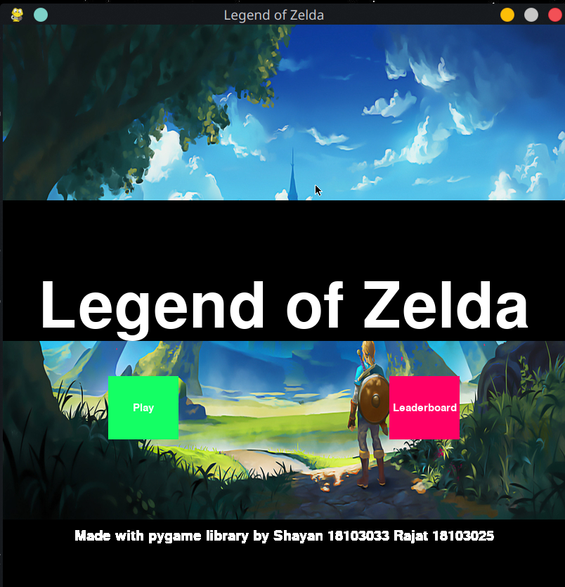
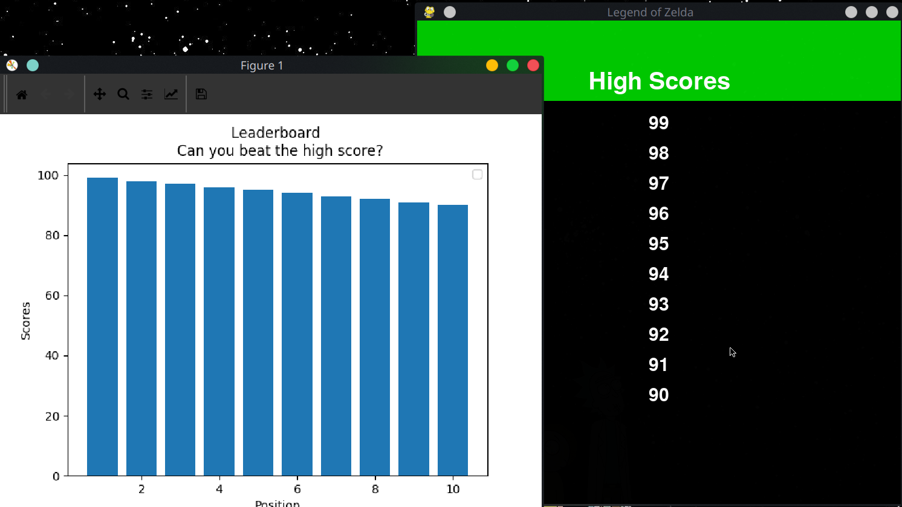
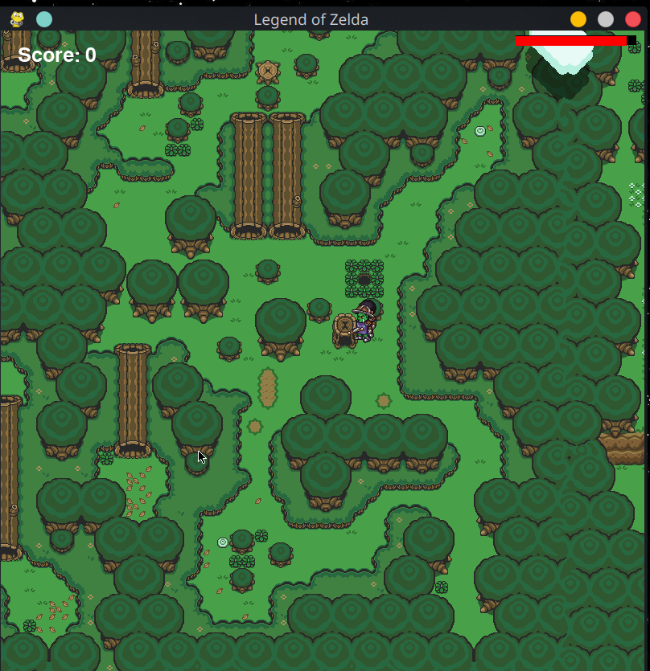
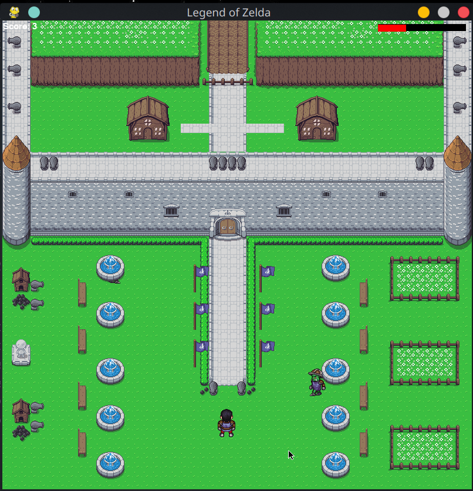

# Made a simple 2D Top-Down Action RPG(?) using pygame. 
We do not own any of the assets used in the making of the game, all credit for art and music goes to their respective creators.

Most of the art is from opengameart.org 

Character and enemy sprites were made using a Universal LLC sprite generator.

Music is ripped from similar games.

